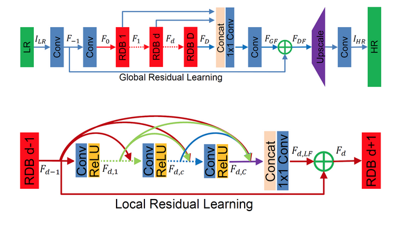

# Super Size Me API
Super Size Me is a super-resolution REST endpoint which increases the resolution of an input image.

In the background, the API applies a computer vision model to mathematically analyze the visual contents of an image and learn an inverse compression algorithm, to upscale the image.

TODO add funny picture of supersize me movei low and high res

# Installation

    pip install -r requirements.txt
  
#### Download RDN model  
TODO host and download model

# Endpoint

`POST <HOST>/supersizeme/`: used to upsample an image.

### Body

The raw binary data of the image. Usually an uploaded image file.

### Parameters

Note: The maximum size for an image is 5MB.  Only `.png` and `.jpg/.jpeg` image file types are allowed.
 
 ## Examples

**Request to upscale an image**:

```
curl -X POST \
  "<HOST>/supersizeme \
  -H "Content-Type: image/<jpg or png>" \
  --upload-file "<image_file>" \
```

**Response**:

```
<binaray output of .PNG formatted image bytes>
```

- Postman will format this binary output to an human visable image automatically. 
- Warning: Binary output can mess up your terminal. Use "--output -" to tell curl to output it to your terminal anyway, or consider "--output <FILE>" to save to a file.

# How Super Resolution Works

From a machine learning perspecitve, super resolution algorithms are an inverse compression function. Where as a compression algorithm, like JPEG, aims to take a high quality image and downsize it with as little perceptual loss as possible, a super resolution algorithm takes a small image and upscale it. 

Specifically, the underlying machine learning algorithm is learning parameters to a function that add the most probable details to an input image.

Non-machine-learning based approaches (interpolation) suffer from the fact they operate on a higly localized pixel level, and often lack high frequency detail, leading to blurry or noisy images. 

Machine learning allows us to learn a mapping between low and high resolution image counterparts, and rely on deep semantic relationships between images (ex. the types of features exracted by a CNN).

High quality results are acheived using a combination of feature extraction via convolutions and learnable upsampling blocks. These may be chained to create progressive upsamping (progressively reconstructing high resolution images at smaller scaling factors at each step.). The advantage of this is to break a large problem into many incremental smaller problems, called curriculum learning. 

Quality can be measured during the training process using a variety of different loss function. Content loss consists of using a pre-trained image classification network to quanitify the semantic feature loss between a upscaled image and ground truth. Adversarial loss uses a GAN to optimize for against perceptual changes in the upscaled image.

## RDN Model

The current implementation used in `ml-services` is an RDN (Residul Dense Network) based approach described in [the original paper here](https://arxiv.org/abs/1802.08797), and with a [pretrained model](https://github.com/idealo/image-super-resolution#rdn-network-architecture) from Idealo. See here for the [source code](https://github.com/idealo/image-super-resolution/blob/master/ISR/models/rdn.py).

The RDN model uses a stack of smaller building blocks called Residual Dense Blocks (RDB). RDBs are essentially a concatenation of several convolution+RELUs used to retain hierarchical features extracted at different stages of the network. 

The output of each RDB has access to each layer of the next RDB, leading to "contiguous memory", or a highly connected information state. Additioanlly, within each RDB, each convolutional layer has access to all the subsequent layers. The interconnectedness of this architecture leads to a highly global preservation of extracted features.

At the end of several RDB blocks, the output is fused into a final layer, which contains many global hierarchical features, and finally upsampled to a high resolution image. The residual nature of learning (feeding extracted information back into subsequent layers), allows for a strong flow of information through the network, preserving local and global features, allowing for a better reconstruction of the high resolution output image.

#### RDN Network architecture

The main parameters of the architecture structure are:

- D - number of Residual Dense Blocks (RDB)
- C - number of convolutional layers stacked inside a RDB
- G - number of feature maps of each convolutional layers inside the RDBs
- G0 - number of feature maps for convolutions outside of RDBs and of each RBD output

Other abbreviations: 
- LR: low resolution
- HR: high resolution
- Conv: convolutional layer
- ReLU: a type of activation function
- RDB: residual dense block 



## Further Reading
More information about super resolution can be found here:
- [Common models](https://medium.com/@birla.deepak26/single-image-super-resolution-using-gans-keras-aca310f33112)
- [Training methods](https://medium.com/beyondminds/an-introduction-to-super-resolution-using-deep-learning-f60aff9a499d)
- [Literature Review](https://arxiv.org/abs/1902.06068)

---
# to do/ could do
- test using a GPU, or at least higher quality CPU on mle
- check into legality of using pretrained model - if not, can we retrain our own model using the same technique? Or swap out other model.
- test other architectures - need to update speed
